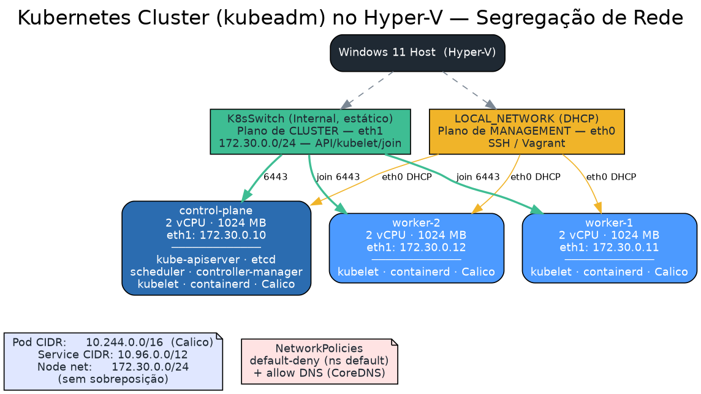

# Vagrant Hyper-V - Kubernetes Cluster com kubeadm

Cluster Kubernetes automatizado com 1 Control Plane + 2 Worker Nodes no Hyper-V (Windows 11).

## Topologia



## Cenário

| VM            | Função         | CPU | RAM    | Componentes |
|---------------|----------------|-----|--------|-------------|
| control-plane | Control Plane  | 2   | 1024MB | kubeadm, kubelet, kubectl, containerd, Calico |
| worker-1      | Worker Node    | 2   | 1024MB | kubeadm, kubelet, containerd |
| worker-2      | Worker Node    | 2   | 1024MB | kubeadm, kubelet, containerd |

## Stack

- **OS**: Ubuntu 22.04 (generic/ubuntu2204)
- **Container Runtime**: containerd
- **Kubernetes**: v1.30 (via kubeadm)
- **CNI**: Calico v3.27
- **Hypervisor**: Hyper-V (Windows 11)
- **Automação**: Vagrant + Shell provisioning

## Pré-requisitos (Windows 11)

### 1. Habilitar Hyper-V

```powershell
Enable-WindowsOptionalFeature -Online -FeatureName Microsoft-Hyper-V -All
```

Reiniciar após a instalação.

### 2. Instalar Vagrant

https://developer.hashicorp.com/vagrant/install

### 3. Verificar

```powershell
vagrant --version
Get-VMSwitch
```

## Como usar

### Subir o cluster

> ⚠️ Executar o terminal como **Administrador**.

```powershell
cd <caminho-do-projeto>
vagrant up --provider=hyperv
```

Selecione o **Default Switch** quando perguntado.

O provisioning executa automaticamente:
1. Instala containerd em todas as VMs
2. Instala kubeadm, kubelet e kubectl
3. Inicializa o cluster no control-plane (`kubeadm init`)
4. Instala o CNI Calico
5. Workers tentam fazer join automaticamente

### Verificar o cluster

```powershell
vagrant ssh control-plane
```

```bash
kubectl get nodes
kubectl get pods -A
```

### Join manual dos workers (se necessário)

Como o Hyper-V usa DHCP, o join automático pode falhar. Nesse caso:

```powershell
# 1. Obter o comando de join
vagrant ssh control-plane -c "cat /home/vagrant/join-command.sh"

# 2. Executar no worker (exemplo)
vagrant ssh worker-1 -c "sudo kubeadm join <IP>:6443 --token <token> --discovery-token-ca-cert-hash <hash>"
vagrant ssh worker-2 -c "sudo kubeadm join <IP>:6443 --token <token> --discovery-token-ca-cert-hash <hash>"
```

### Se o token expirar (24h)

```powershell
vagrant ssh control-plane
```

```bash
# Gerar novo token
kubeadm token create --print-join-command
```

## Comandos úteis

```powershell
# Status das VMs
vagrant status

# Acessar VMs
vagrant ssh control-plane
vagrant ssh worker-1
vagrant ssh worker-2

# Parar o cluster
vagrant halt

# Destruir tudo
vagrant destroy -f

# Recriar apenas um worker
vagrant destroy worker-1 -f && vagrant up worker-1 --provider=hyperv
```

## Estrutura do projeto

```
.
├── Vagrantfile              # Definição das 3 VMs
├── README.md                # Este arquivo
└── scripts/
    ├── common.sh            # Pré-requisitos + containerd + kubeadm (todas as VMs)
    ├── control-plane.sh     # kubeadm init + Calico (somente control-plane)
    └── worker.sh            # kubeadm join (somente workers)
```

## Observações sobre Hyper-V + Kubernetes

### Rede
- O Hyper-V atribui IPs via DHCP (Default Switch). Não há IPs estáticos via Vagrant.
- O `kubeadm init` usa o IP detectado no `eth0` como `--apiserver-advertise-address`.
- O Calico gerencia a rede de pods (CIDR: 192.168.0.0/16).

### Para IPs fixos (recomendado para produção)

Crie um switch interno no Windows:

```powershell
New-VMSwitch -SwitchName "K8sSwitch" -SwitchType Internal
New-NetIPAddress -IPAddress 172.89.0.1 -PrefixLength 24 -InterfaceAlias "vEthernet (K8sSwitch)"
New-NetNat -Name "K8sNAT" -InternalIPInterfaceAddressPrefix "172.89.0.0/24"
```

### Troubleshooting

```bash
# No control-plane - verificar status dos componentes
kubectl get nodes -o wide
kubectl get pods -A
systemctl status kubelet
journalctl -u kubelet -f

# Verificar containerd
systemctl status containerd
crictl ps

# Re-gerar token de join
kubeadm token create --print-join-command

# Reset de um node (para refazer o join)
sudo kubeadm reset -f
```
